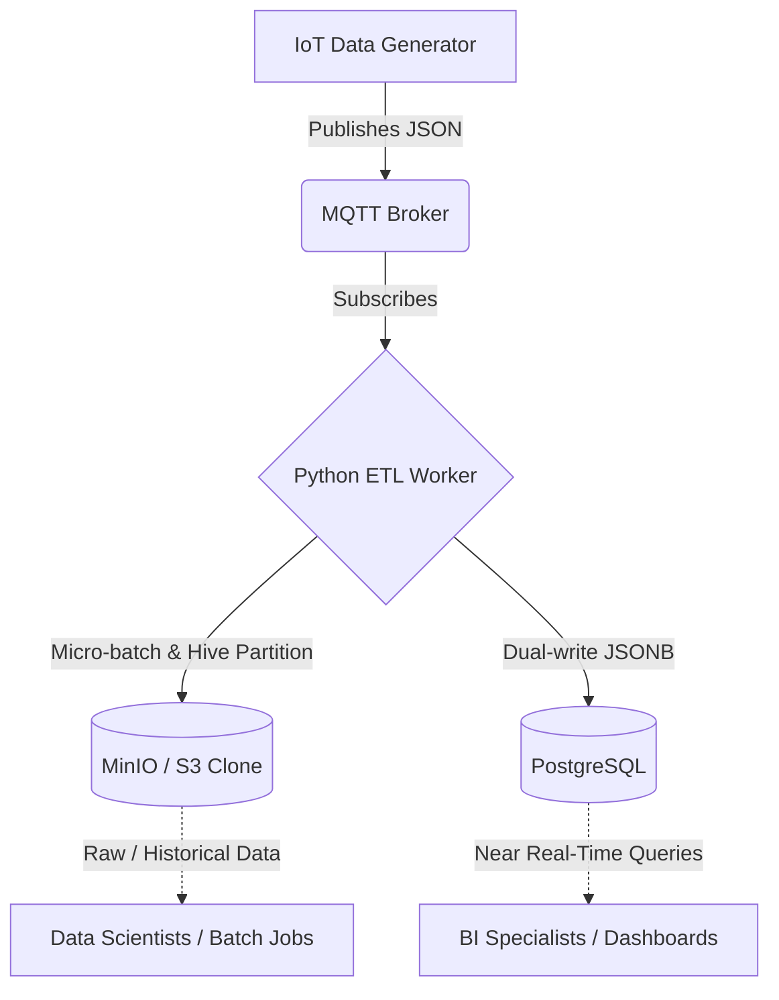

# Data Engineer - Challenge

## Intro

This repository contains my solution for the Data Engineering Challenge. The objective was to ingest near real-time IoT sensor data, persist it for batch processing, and make it available for BI specialists—all while keeping the solution pragmatic and functional within a tight timebox.

## 1. Current Architecture (Local Prototype)

For this local Docker-based prototype, I implemented a simplified **Lambda-style** architecture to meet the challenge's strict time constraints.

### Initial position

* List of Sensors (see iot_data_generator/sensors.json)
* Docker compose environment containing
    * IoT data generator (python, docker)
    * MQTT Broker



### Part One: Coding Challenge

Services Used:

* MQTT Broker: Message ingestion.
* Python ETL Worker: Custom script with multi-threading and micro-batching.
* MinIO: S3-compatible object storage for the Raw data layer.
* PostgreSQL: Relational database acting as the serving layer for BI.

#### Step 1:

The first goal is to collect and store the IoT data as well as the corresponding
sensors in raw format to a low cost long term storage.

##### Reviving Legacy Code (Dependency Management)
Issue: The provided IoT Data Generator failed to build due to a pydantic v1 vs. v2 conflict and a C-compiler error with an old version of PyYAML.

Fix: Downgraded the generator's Dockerfile base image to python:3.9-slim to utilize pre-built wheels, successfully bypassing the dependency rot .

##### Implementing the Data Lake (MinIO)
Deployed MinIO as an S3 alternative to demonstrate a cloud-native mindset.

Implemented an ephemeral minio-init container to automatically provision the iot-raw-bucket on startup.

Partitioning Strategy: Used Hive-style time partitioning (year=YYYY/month=MM/day=DD/hour=HH) in the object keys to optimize future downstream queries.

###### Building the Python ETL Worker
* Micro-batching: Engineered an in-memory buffer to flush data to MinIO and Postgres every 100 messages or 10 seconds.
* Thread Safety: Utilized threading.Lock() to prevent race conditions between the asynchronous MQTT on_message callback and the main processing loop.
* Resiliency: Added exponential backoff retry logic to the database connection to handle Docker container startup lag.

#### Step 2:

The second goal is to make the data available so BI specialists can query
historical data until current point in time (near real time) for different
sensors.

##### Enabling Near Real-Time BI (PostgreSQL)
Deployed PostgreSQL with a highly flexible JSONB schema to absorb unpredictable sensor payload structures.

Promoted the dt (Event Time) key to a first-class TIMESTAMPTZ column to allow BI tools to run lightning-fast time-series queries, while keeping the rest of the payload in JSONB.

#### Step 3 :

Improvements suggested: 

* resample IoT data to 1 min mean values
* data catalogue for customers
* data quality indicator
  * Implement a "Shift-Left" data quality check inside the ETL worker.
    The script evaluates the sensor value against logical physical bounds (0-100) and appends a boolean "is_valid": true/false flag to the payload before it hits the database.

### Part Two: Solution Design

Imagine you're not bound to local development, so you could use whatever
services and products are out there.

* How would you solve the problem stated in Part One now?

##### Cons of the Current Solution
Tightly Coupled Compute and Storage: The ETL worker handles both stream ingestion and database loading. It cannot be scaled independently.

No Silver/Gold Refinement: The BI team is querying data that is only one step removed from raw JSON.

Database Bottleneck: While JSONB is great for flexibility, running heavy aggregations over billions of rows in standard PostgreSQL will eventually degrade performance compared to a true OLAP columnar database.


## ☁️ 5. Proposed Production Architecture & Operational Design

To transition this proof-of-concept into a secure, fault-tolerant, and enterprise-grade system capable of handling billions of data points, I propose a decoupled **Medallion Architecture** using AWS, Databricks, and Apache Airflow.


## How to Run Locally
Ensure Docker and Docker Compose are installed.

Clone this repository.

Run
```sh
 docker compose up -d --build
 ```

Access MinIO: http://localhost:9090 (User: minioadmin / Pass: minioadmin)

Access Postgres: Connect your SQL client to localhost:5432 (DB: iot_data, User/Pass: postgres).
